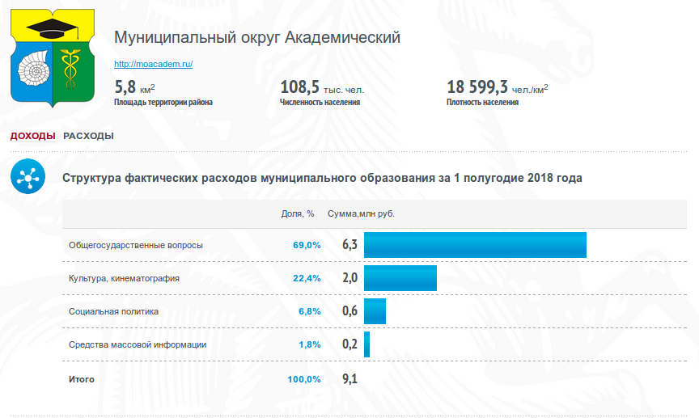
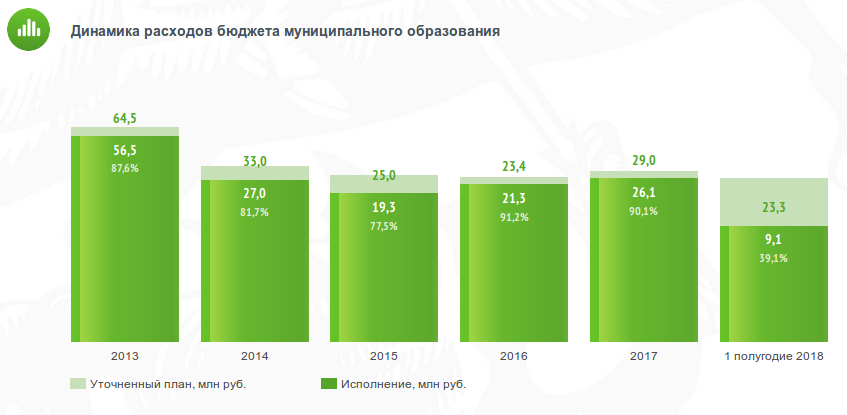
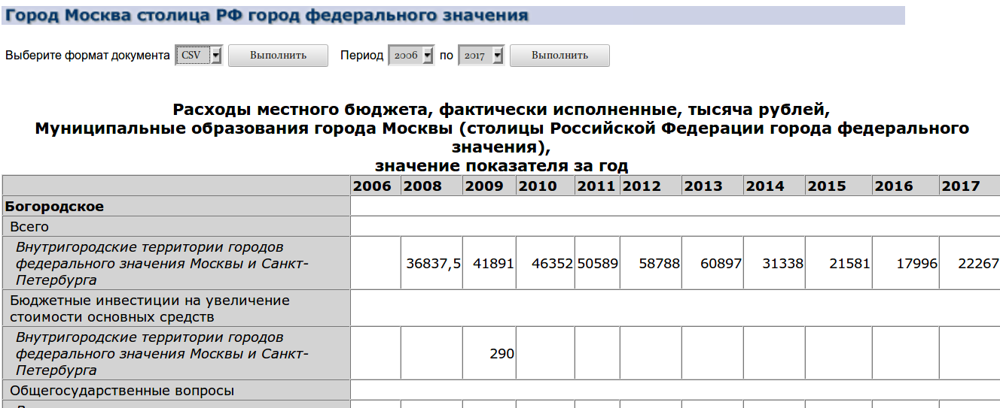

class: inverse, center, middle

# Цели

---

Получить и визуализировать на карте данные по динамике разных статей бюджета муниципалитетов г. Москвы.

--

- Граждане и организации, заинтересованные в получении информации об использовании доходной части бюджета, формируемой в значительной степени из уплачиваемых ими налогов.

--

- Исследователи, аналитики в финансово-бюджетной сфере, учащиеся, ученые.

--

- Чиновники, заинтересованные в отловле ошибок, происходящий на этапе передачи данных от муниципалитета.

---
class: inverse, center, middle

# Источник данных

---

На сайте [Открытого бюджета города Москвы](budget.mos.ru) для каждого муниципалитета есть такое:

:( Только **за 1 полугодие 2018 года**...

---

И еще такое:

Однако, что если мы хотим узнать, сколько каждый муниципалитет тратит, например, на культуру и кинематограф? Какая динамика этих трат по годам?

---

Есть данные [Федеральной службы государственной статистики](http://www.gks.ru/), однако там тоже все не так просто:

Данные имеют иерархическую структуру, да и еще и статьи расходов отличаются от сайта [Открытого бюджета города Москвы](budget.mos.ru).

---

- Данные с сайта [Открытого бюджета города Москвы](budget.mos.ru) за 2018 (краулер)
- Данные с сайта [Открытого бюджета города Москвы](budget.mos.ru) за 2006--2017 (скрипт для обработки  .csv файла)
- .geojson предоставили организаторы хакатона,

--
 но пришлось исправлять в нем ошибки (еще один скрипт)
 
--

Были взяты следующие статьи

.pull-left[
- Налоговые доходы
- Неналоговые доходы
- Безвозмездные поступления
- Общий доход
]

.pull-right[
- Общегосударственные вопросы
-	Культура, кинематография
-	Социальная политика
-	Средства массовой информации
-	Расходы: итого
-	Национальная экономика
-	Жилищно-коммунальное хозяйство
-	Образование
-	Национальная безопасность и правоохранительная деятельность
-	Физическая культура и спорт
-	Национальная оборона
-	Охрана окружающей среды 
]
---
class: inverse, center, middle

# Результаты

---
class: middle

- Данные (17534 на 6) по динамике разных статей со столбцами:
    - муниципалитет
    - статья бюджета
    - значение
    - тип статьи (доход/расход)
    - год
    - источник данных
- [Сайт](https://agricolamz.github.io/2018_mosfindata_hackathon_4/01_tax.html), который содержит   16 (статей) $\times$ 2 (типа представления) $\times$  13 (лет) = 416 карт,   показывающий динамику доходов и расходов московских муниципалитетов

- Несколько предложений для огранизации данных составителям баз данных [Открытого бюджета города Москвы](budget.mos.ru) и [Федеральной службы государственной статистики](http://www.gks.ru/)

---

# Все не так просто:

Один из менторов, Андрей Венедиктович Семункин, подсказал, что одна и та же статья может покрываться не только муниципальным бюджетом, но и бюджетом города Москвы.

---

class: center, middle

# Спасибо!

[Давайте посмотрим сайт!](https://agricolamz.github.io/2018_mosfindata_hackathon_4/01_tax.html)

